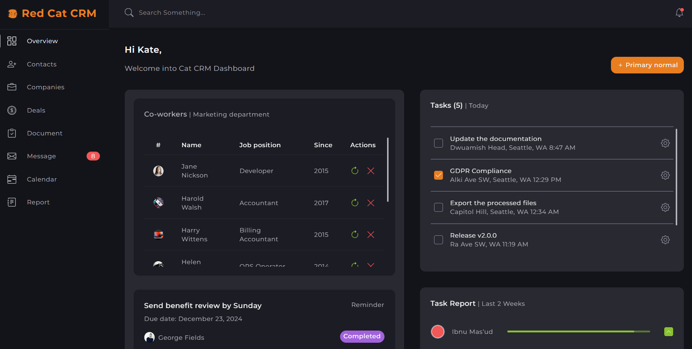

# 🐱 Red Cat-CRM mini project (HTML + Sass)

This is a mini CRM project with such used technoligies as HTML, CSS, Sass and minimal JavaScript. It is created to practice Sass(Syntactically Awesome Style Sheets) preprocessors skills. The project is full of main Sass fundamenta principles:

- modern Sass syntax
- pattern 7-1 (7 catalogues and 1 file main.scss where all the folders are connected).
  As long as it`s a mini project I have only 3 folders to connect in main.scss and utils folders, of course.
- utils folder consists of basic set of helpers: mixins, variables, placeholders and functions. They help to use and reuse common patterns along the whole project applying to the map of colors, fonts etc.

